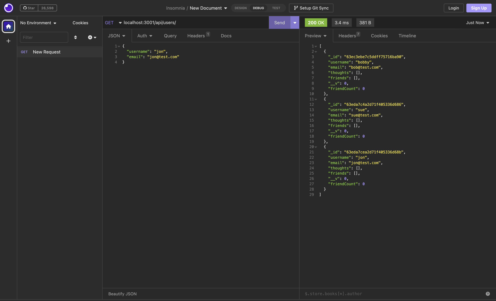

# Social Network API

## Description

This application is an API for a social network enabling users to create thoughts and react to other thoughts. They can also be added to other users' friends lists. It is entirely a backend tool where functionality can be viewer using Insomnia.

[Link To Repo](https://github.com/asreedy82/social-network-api)

## Installation

Clone the code from the repo and run `npm install` in terminal. Then run `node index.js` in terminal and you can connect to Insomnia for testing.

[Link To Video](https://watch.screencastify.com/v/0OroWXi4mJ7IJEX1shpN)

## Usage

The application is designed to as a backend tool to enable features for a social network. Features include sharing thoughts, reacting to thoughts, adding and removing friends.

## Credits

N/A

## License

N/A

### Author: Anthony Reedy